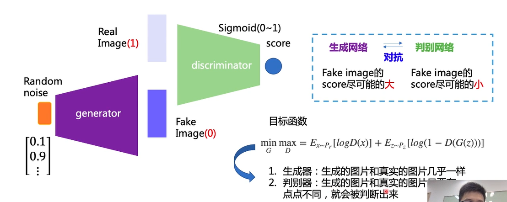
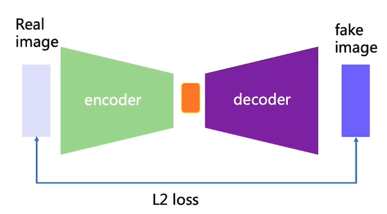
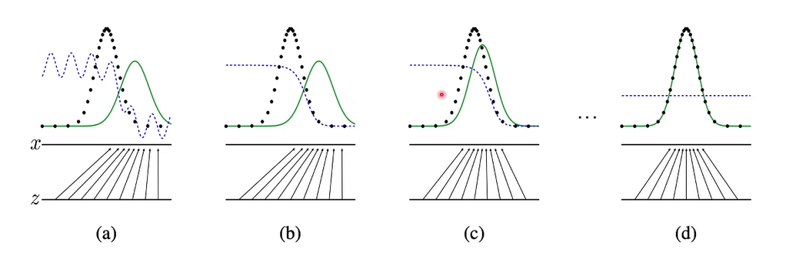
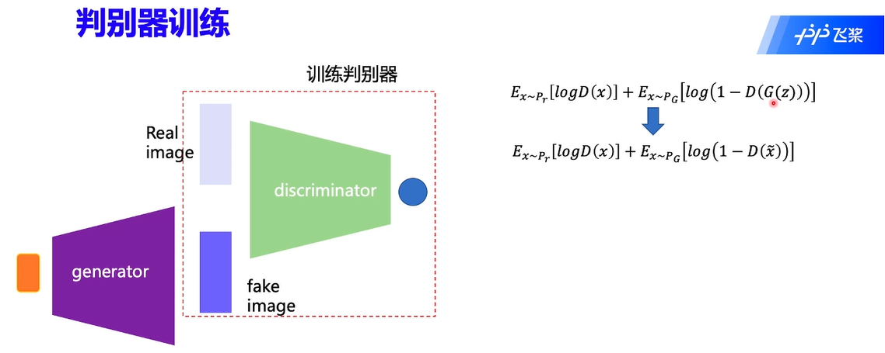
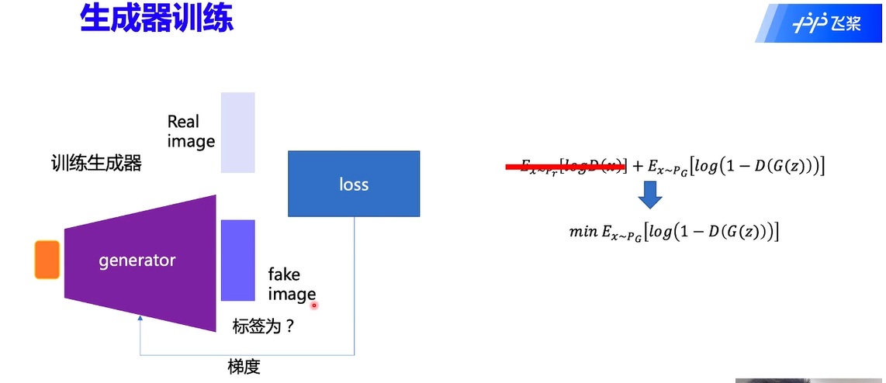
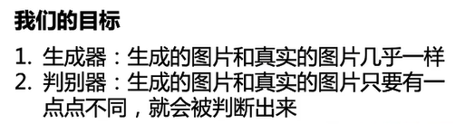
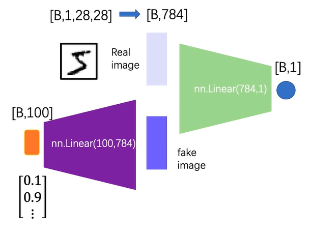
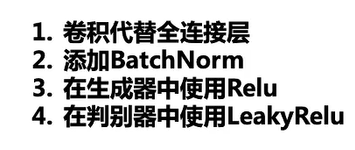

# 生成对抗网络(GAN)

## 一.  介绍

### 1.1  概述

1. 应用：

   - 数据生成
   - 图片翻译
   - 风格迁移
   - 超分辨率
   - 图像修复
   - 等等等等

2. 发展：

   > 科研领域关注度指数型增长
   >
   > 过去十年机器学习领域最有趣的想法之一

   - 网络结构
   - 条件生成网络
   - 图像翻译
   - 归一化和限制
   - 损失函数
   - 评价指标

3.  什么是GAN：

   - 不同于分类、分割、目标检测等判别模型，GAN是一种**生成模型**，通过随机噪、声来生成对应数据。

### 1.2  原理

1. 基础结构：

   - GAN包括**生成器**和**判别器**，基础结构如下：

     

   - Auto Encoder：

      

     我们对整个网络进行训练，但是最终只保留decoder部分，那么它与GAN有什么区别呢

   - Auto Encoder 使用L2 loss，在point-wise上进行优化，虽然效果稳定但是模糊；GAN使用Distribution match(分布匹配)的方法，效果清晰但是不够稳定。

     因此很多任务如图像翻译、超分辨率重建等都将这二者结合使用。

2. 一点点理论：

   - 生成器将输入的随机噪声由原来的分布映射到最终所需要的分布，并由判别器与其对抗来不断优化。

     

   - 判别器训练：

     

     判别器训练时会冻结生成器的参数，**且将生成的fake image标签置为0**，其损失函数为二分类的交叉熵函数。

   - 生成器训练：

     

     生成器训练时同样会固定判别器的参数，此时判别器相当于一个损失函数。我们去掉不相关的部分可得到如下：
     $$
     E_{xP_g}[\log(1-D(G(z)))]
     $$
     在这里，我们将fake image的标签置为1。

   - GAN的目标：

     

### 1.3   DCGAN

1. 结构：

   最初的GAN：

   

   DCGAN(Deep Convlutional GAN)：	

   

2. 生成手写数字训练过程代码：

   ```python
   import torch
   import torch.nn as nn
   import torch.optim as optim
   
   # Initialize BCELoss function
   criterion = nn.BCELoss()
   
   real_label = 1
   fake_label = 0

   # Setup Adam optimizers for both G and D
   optimizerD = optim.Adam(netD.parameters(), lr=0.002, betas=(
       0.9, 0.999), eps=1e-08, weight_decay=0)
   optimizerG = optim.Adam(netG.parameters(), lr=0.002, betas=(
       0.9, 0.999), eps=1e-08, weight_decay=0)
   
   losses = [[], []]
   now = 0
   for epoch in range(len(epoch_num)):
       netD.train()
       netG.train()
       for i, (data, target) in enumerate(dataloader):
           # Updata netD
           optimizerD.zero_grad()
   
           real_img = data
           labels = torch.ones((batch_size, 1, 1, 1))
           real_out = netD(real_img)
   
           lossD_real = criterion(real_out, labels)
           lossD_real.backward()
   
           noise = torch.randn((batch_size, 100, 1, 1))
           fake_img = netG(noise)
           labels = torch.zeros((batch_size, 1, 1, 1))
   
           fake_out = netD(fake_img.detach())
           lossD_fake = criterion(fake_out, labels)
           lossD_fake.backward()
   
           optimizerD.step()
           optimizerD.zero_grad()
   
           lossD = lossD_fake+lossD_real
           losses[0].append(lossD.numpy())
   
           # Updata netG
           optimizerG.zero_grad()
   
           noise = torch.randn((batch_size, 100, 1, 1))
           fake = netG(noise)
           labels = torch.ones((batch_size, 1, 1, 1))
   
           output = netD(fake)
           lossG = criterion(output, labels)
           lossG.backward()
   
           optimizerG.step()
           optimizerG.zero_grad()
   
           losses[1].append(lossG.numpy())
   
   ```
   
   

