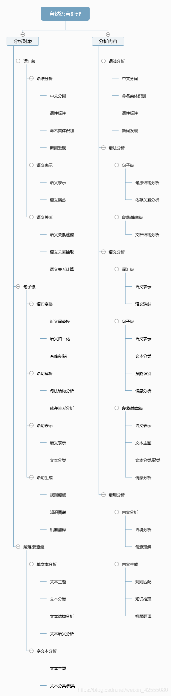

# **自然语言处理(NLP)**

## **概述**

1. 什么是NLP:

  自然语言处理（Natural Language Processing，NLP）是计算机科学领域与人工智能领域中的一个重要方向。它研究人与计算机之间用自然语言进行有效通信的理论和方法。融语言学、计算机科学、数学等于一体的科学。旨在从文本数据中提取信息。目的是让计算机处理或“理解”自然语言，以执行自动翻译、文本分类和情感分析等。自然语言处理是人工智能中最为困难的问题之一。

2. NLP主要技术范畴:

    

    1. 语义文本相似度分析
    2. 信息检索、抽取、过滤
    3. 文本分类
    4. 文本挖掘
    5. 文本情感分析
    6. 问答系统
    7. 机器翻译
    8. 自动摘要
    9. 语音识别
    10. 机器创作

3. NLP库:

    1. Natural language tooklkit(NLTK):
    一种流行的自然语言处理库，自带语料库，具有分类分词等很多功能，国外是使用者居多，类似中文的jieba处理库。
    2. Apache OpenNLP.
    3. Stanford NLP suite.
    4. Gate NLP library.

4. 所需基础：

    - 线性代数：向量、矩阵、距离计算（余弦距离、欧氏距离、曼哈顿距离、明可夫斯基距离、切比雪夫距离、杰卡德距离、汉明距离、皮尔逊相关系数）
    - 概率论：随机试验、条件概率、全概率、贝叶斯定理、信息论。
    - 统计学：图像可视化、数据度量标准、概率分布、统计假设检验。
    - 语言基础：语音、词汇、语法。

## 自然语言处理基本点

### 语料库（Corpus）

​     语料库中存放的是在语言的实际使用中真实出现过的语言材料；语料库是以电子计算机为载体承载语言知识的基础资源；真实语料需要经过加工（分析和处理），才能成为有用的资源。

### 中文分词（Chinese Word Segmentation）

1. 中文分词指的是将一个汉字序列切分成一个一个单独的词。分词就是将连续的字序列按照一定的规范重新组合成词序列的过程。
2. 现有的分词方法可分为三大类：基于字符串匹配的分词方法、基于理解的分词方法和基于统计的分词方法。
3. 比较流行的中文分词工具：jieba、StanfordNLP、HanLP、SnowNLP、THULAC、NLPIR。

### 词性标注（Part-of-speech tagging）

1. 词性标注是指为给定句子中的每个词赋予正确的词法标记，给定一个切好词的句子，词性标注的目的是为每一个词赋予一个类别，这个类别称为词性标记（part-of-speech tag），比如，名词（noun）、动词（verb）、形容词（adjective）等。
2. 词性标注是一个非常典型的序列标注问题。最初采用的方法是隐马尔科夫生成式模型， 然后是判别式的最大熵模型、支持向量机模型，目前学术界通常采用的结构是感知器模型和条件随机场模型。近年来，随着深度学习技术的发展，研究者们也提出了很多有效的基于深层神经网络的词性标注方法。

### 句法分析（Parsing）

1. 基于规则的句法结构分析
2. 基于统计的语法结构分析

### 词干提取（Stemming）

词干提取是将词语去除变化或衍生形式，转换为词干或原型形式的过程。词干提取的目标是将相关词语还原为同样的词干。

### 词形还原（Lemmatization）

将一组词语还原成词源或词典的词目形式的过程

### 停用词过滤

指过滤一些在文本中经常出现且对文本信息的内容贡献不大甚至无贡献的词语，如常见的介词、冠词、助词、情态动词、代词以及连词等。

### 词向量化（Word Vector）

将自然语言准话为向量形式，以便于处理。

### **命名实体消歧（Named Entity Disambiguation）**

命名实体的歧义指的是一个实体指称项可对应到多个真实世界实体，确定一个实体指称项所指向的真实世界实体，这就是命名实体消歧。例如：苹果既指可使用的苹果，也指苹果公司。一般来说，命名实体要求有一个实体知识库，能够将句子中提到的实体和知识库联系起来。

### 命名实体识别（Named Entity Recognition）

命名实体识别是识别一个句子中有特定意义的实体并将其区分为人名，机构名，日期，地名，时间等类别的任务。（分类）

可用算法有：CRF，字典法和混合方法等

## 文本预处理

### 作用

文本语料在输送给模型前一般需要一系列的预处理工作，使其符合模型的要求。

### 文本处理基本方法

- 分词
- 词性标注
- 命名实体识别

### 文本张量表示方法

- one-hot编码
- word2vec
- word embedding

### 文本语料数据分析

- 标签数量分布
- 句子长度判断
- 词频统计与关键词词云

### 文本特征处理

- n-gram特征
- 文本长度规范

### 数据增强方法

- 回忆数据增强法

## jieba的使用：

