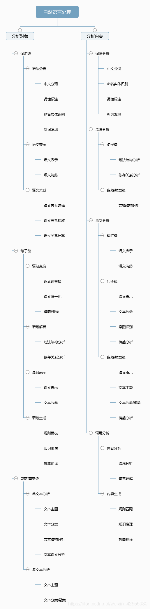

# **自然语言处理(NLP)**

## **一.概述:**

1. 什么是NLP:
简单来说，自然语言处理(NLP)就是开发能够理解人类语言的应用程序或服务,如语音识别、语音翻译、理解完整的句子、理解匹配词的同义词，以及生成语法正确完整句子和段落。

2. NLP实现:
    1. 搜索引擎: 比如谷歌，Yahoo等。谷歌搜索引擎知道你是一个技术人员，所以它显示与技术相关的结果；

    2. 社交网站推送:比如Facebook News Feed。如果News Feed算法知道你的兴趣是自然语言处理，就会显示相关的广告和帖子。

    3. 语音引擎:比如Apple的Siri。

    4. 垃圾邮件过滤:如谷歌垃圾邮件过滤器。和普通垃圾邮件过滤不同，它通过了解邮件内容里面的的深层意义，来判断是不是垃圾邮件。

3. NLP库:

    1. Natural language tooklkit(NLTK):
    一种流行的自然语言处理库，自带语料库，具有分类分词等很多功能，国外是使用者居多，类似中文的jieba处理库。

    2. Apache OpenNLP.

    3. Stanford NLP suite.

    4. Gate NLP library.

## **内容:**

1. 

# 文本预处理

