# 计算机音乐

## 一、音乐与计算

### 1.  音乐离不开计算

首先给出很重要的图：

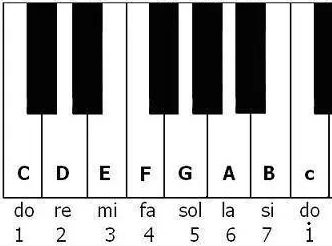

我们可以看到mi和fa是半音关系，si和do也是半音关系，纯五度需要间隔7个半音，纯四度需要间隔5个半音。

1. 十二平均律：在中国又被称作“三分损益法，五度相生率“
   1. **三分损益**：将某个音定为基音，假设该音由一弦发出，“损”指将弦分为三份取其中两份，**新弦长与原弦长比为2:3**，即可得到基音上方纯五度音（即比基音频率高），“益”指将其分为三份，增加一份，**新弦长与原弦长比为4:3**，即可得到基音下方纯四度音。因此我们只要不断重复“损”，“增”，便可以得到一个八度内的全音，如图：

   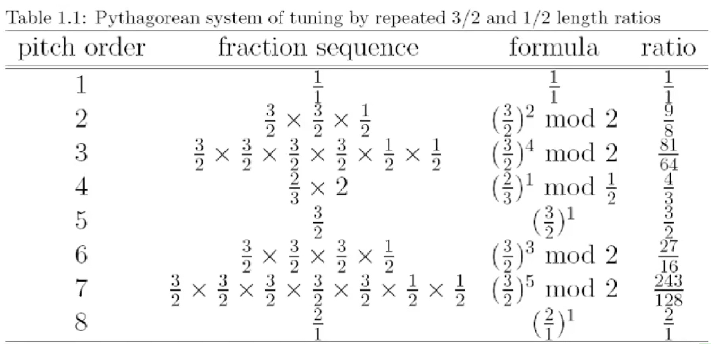

   ​	我们可以依次得到如下图所示的音

   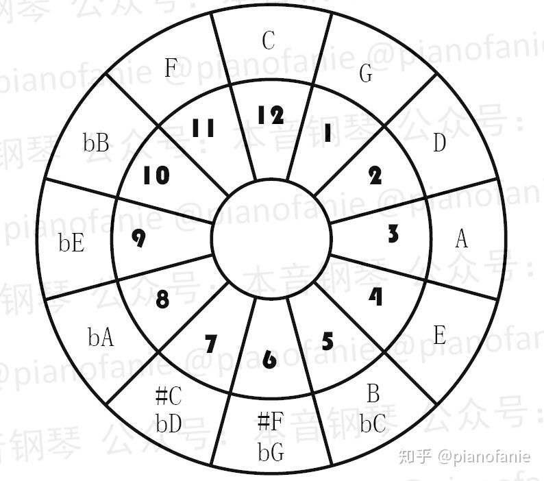

   2. **五度相生**：即在**新弦长与原弦长的比为1:2**时，可得到基音上方八度音。

   这看起来似乎十分完美，但是注意我们通过do上方纯八度的do，然而2/1不可能是3/2的整数次方，也就是说，**通过五度相生律得到的do和实际的do有区别**，因此我们引入了十二平均律。
   
    3. **十二平均律**：我们使用公式来表示不同音之间的频率关系：
       $$
       2^{\frac{x}{12}}
       $$
       

### 2.  计算机在音乐方面的应用

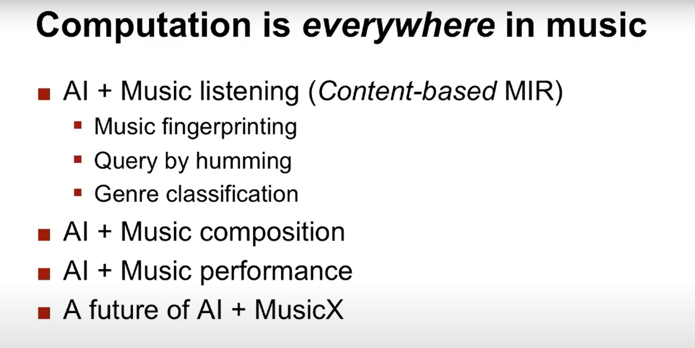

#### 计算机听觉（基于内容的音乐检索）

1. 音乐指纹

   - 将音乐通过内容进行编码，方法如下

     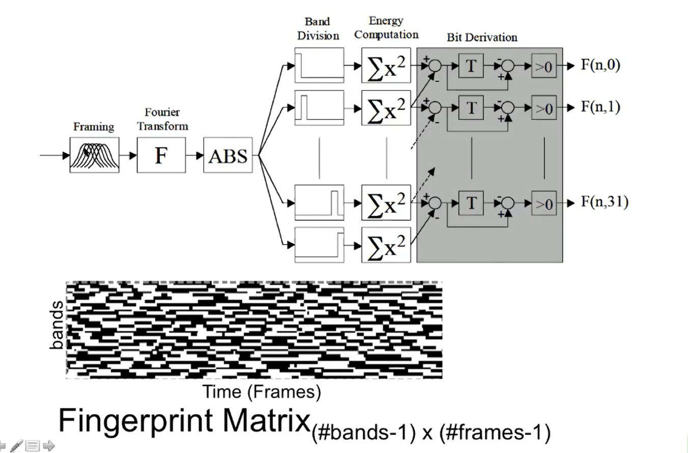

     取一系列窗口进行短时傅里叶变换，ABS去除相位，将其按照频率分为不同的band，$\sum x^2$求出其能量值，最后进行编码。

     实现细节

     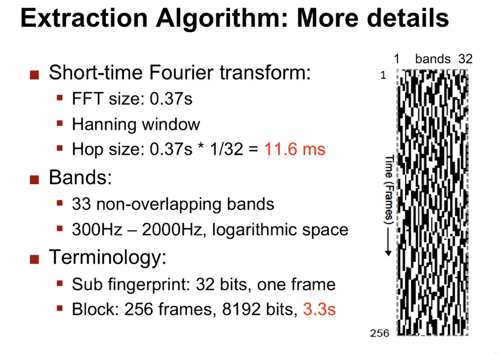

     Hop size：两个窗口之间的间隔，越短越能保证在任意时刻检索的准确性。

     bands：按照人类听觉范围划分为33个bands。

     该算法鲁棒性极高，即使信噪比为负，其匹配率也大于0.58。

2. 哼唱检索

   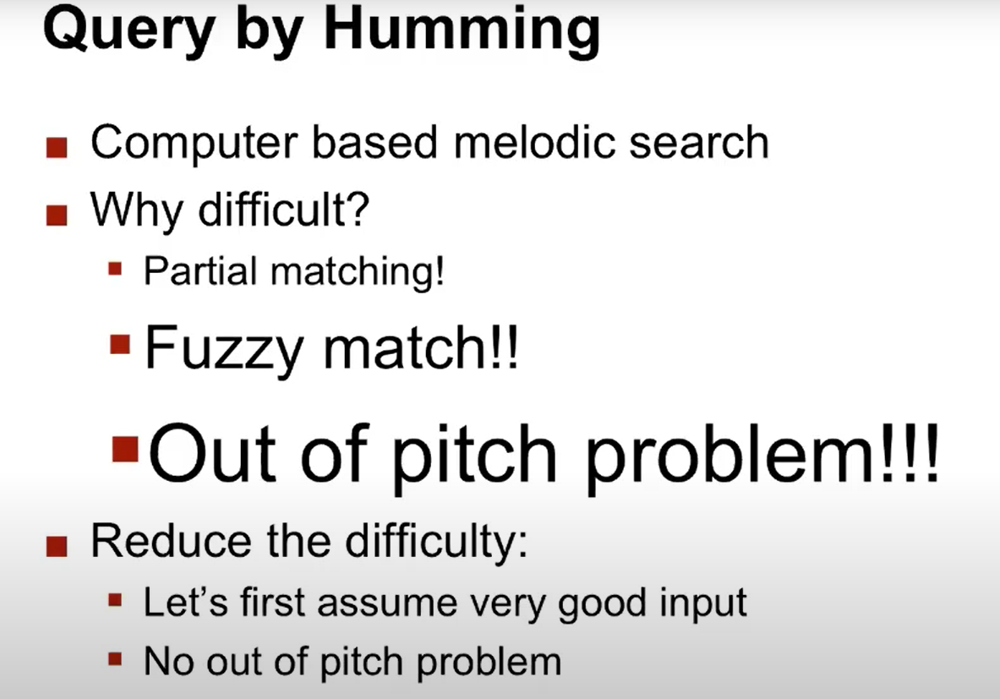

   难点：部分匹配（不哼唱整首歌），模糊匹配（哼唱和唱不一样），跑调。

3. 风格分析

   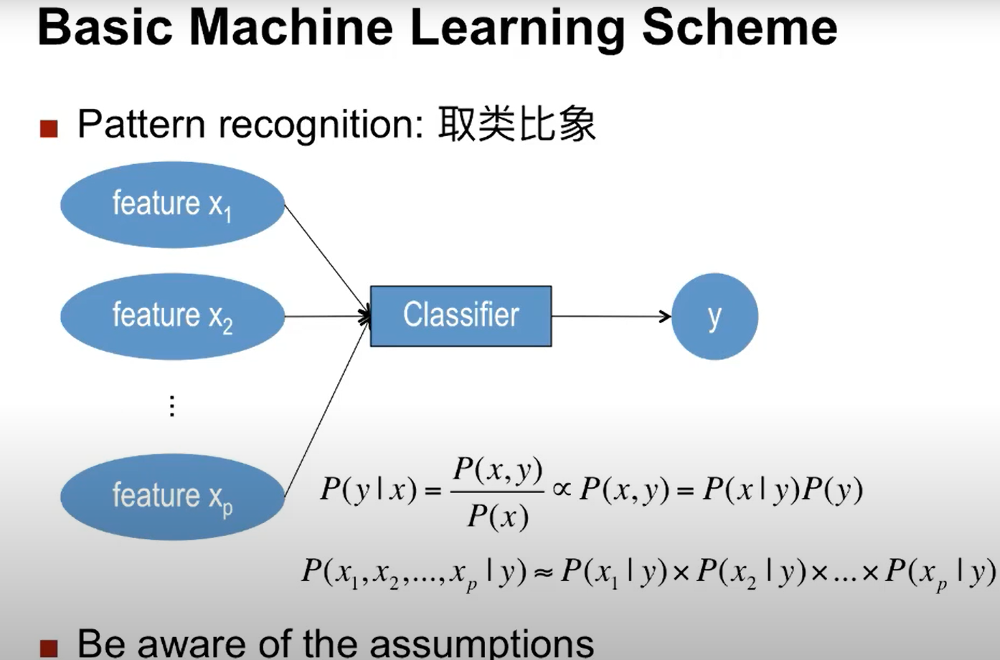

   通过x（已知特征）和y（输入）的联合概率和y的先验概率（这类音乐占总音乐的概率），通过贝叶斯定理即可求出y为何种风格的概率。

   有哪些特征

   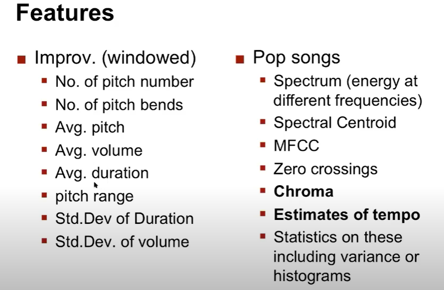

   Chroma

   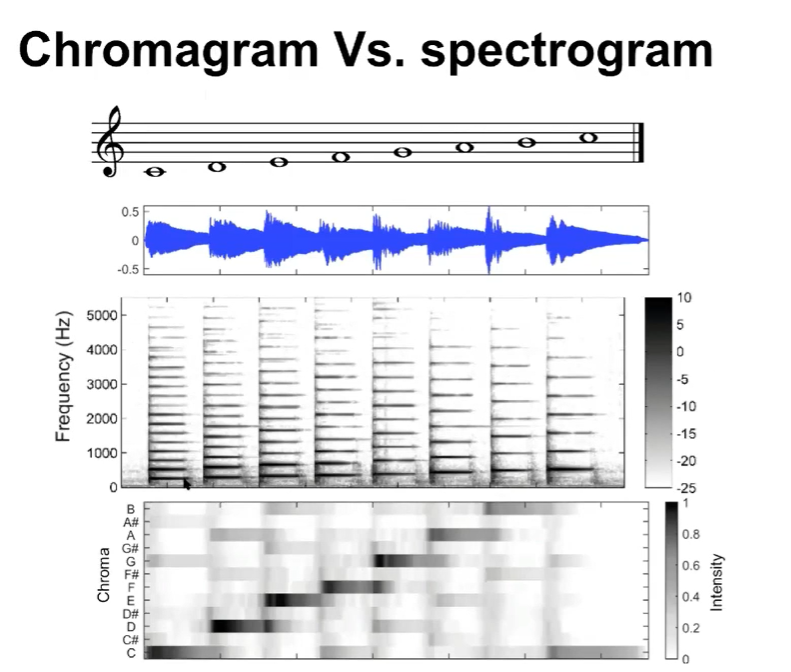

   2. 计算机作曲

      通过分形进行作曲

      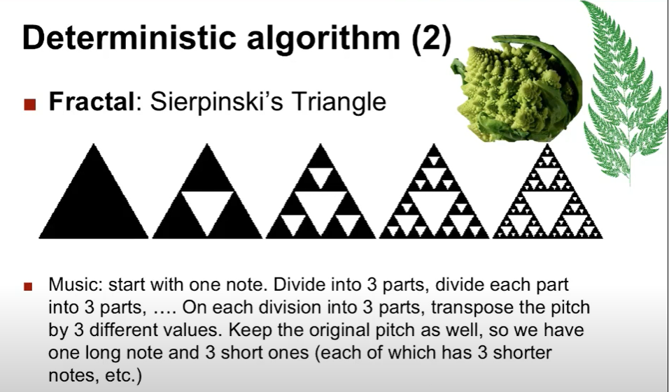

      马尔可夫方法

      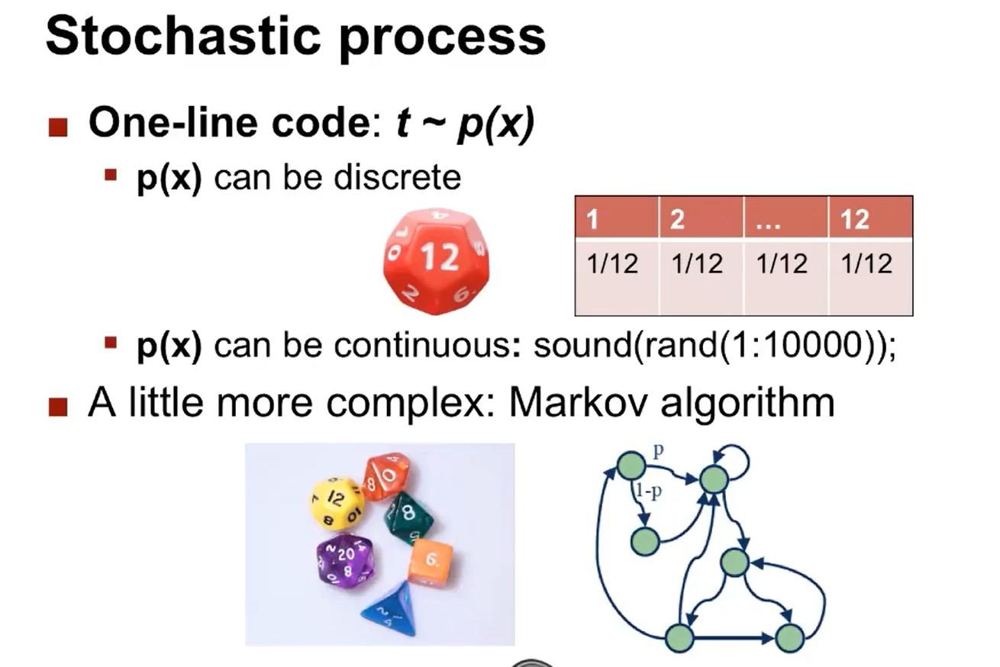

      [WaveNet](https://zhuanlan.zhihu.com/p/28849767)

      通过排序算法作曲

      通过对音符进行切分重组作曲

4. [音乐指挥](https://www.youtube.com/watch?v=dPeh3XVlmlE)

## 二、深度学习在音乐方面的应用